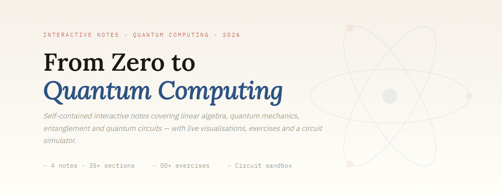

<div align="center">

# ⚛️ QuantumNotes

**Interactive notes for Quantum Computing — live in your browser, no setup required.**

[](https://fre0grella.github.io/QuantumNotes/)

[](LICENSE)

</div>

---



Self-contained, browser-first interactive notes covering the full Quantum Computing curriculum — from linear algebra and qubits through entanglement, quantum circuits and algorithms. Built with [Astro](https://astro.build) and inspired by the course of **Prof. Marco Chiani** at Università di Bologna.

---

## ✨ Features

- 📐 **Live visualizations** — Bloch sphere, state vectors, probability amplitudes rendered interactively
- 🧮 **Interactive canvases** — explore quantum operations by hand with real-time feedback
- 🔌 **Drag-and-drop circuit simulator** — powered by [Q.js](https://github.com/stewdio/q.js)
- 📦 **Zero installation** — everything runs in the browser via GitHub Pages
- 🔢 **Math-first design** — equations alongside intuition, no hand-waving

---

## 🚀 Run Locally

```bash
git clone https://github.com/Fre0Grella/QuantumNotes.git
cd QuantumNotes
npm install
npm run dev
```

Then open [http://localhost:4321](http://localhost:4321).

---

## 🏗️ Tech Stack

- **[Astro](https://astro.build)** — static site framework
- **[Q.js](https://github.com/stewdio/q.js)** — quantum circuit simulator (© Stewart Smith, MIT License)
- **GitHub Pages** — zero-cost hosting

---

## 📄 License

Licensed under [PolyForm Noncommercial 1.0.0](LICENSE) —
free for personal, educational and non-commercial use with attribution.

For commercial licensing, [contact the author on GitHub](https://github.com/Fre0Grella).

---

<div align="center">
  <sub>Made with ❤️ by <a href="https://github.com/Fre0Grella">Fre0Grella</a> · inspired by the notes of <strong>Lorenzo Valentini</strong></sub>
</div>
